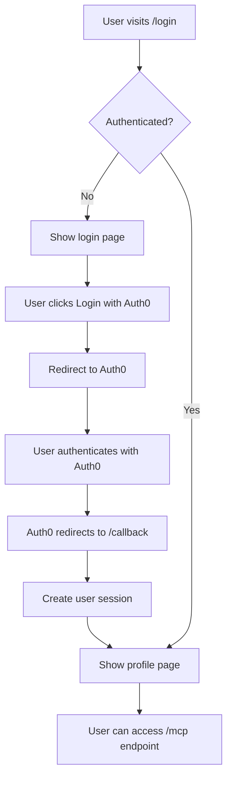

# OAuth Implementation Summary

## Overview

This document summarizes the Auth0 OAuth integration added to the MCP Weather Server's HTTP transport.

## What Was Implemented

### 1. Authentication Infrastructure

**New Files Created:**
- `src/auth.ts` - Auth0 configuration and middleware
- `src/views.ts` - HTML pages for login and profile
- `.env.example` - Environment variable template
- `AUTH0_SETUP.md` - Detailed setup guide
- `test-server.js` - Testing script

**Modified Files:**
- `src/http.ts` - Added OAuth middleware and protected routes
- `package.json` - Added OAuth dependencies and scripts
- `README.md` - Updated with OAuth documentation

### 2. Dependencies Added

**Production Dependencies:**
- `express` - Web framework (was missing)
- `express-session` - Session management
- `passport` - Authentication middleware
- `passport-auth0` - Auth0 strategy for Passport
- `dotenv` - Environment variable loading
- `cors` - Cross-origin resource sharing

**Development Dependencies:**
- TypeScript type definitions for all new packages
- `node-fetch` - For testing scripts

### 3. Authentication Flow



### 4. Security Features

- **Session-based authentication** using secure HTTP sessions
- **CSRF protection** through Auth0's state parameter
- **Environment variable validation** on server startup
- **CORS configuration** for cross-origin requests
- **Secure cookies** in production mode
- **Protected MCP endpoint** requiring authentication

### 5. API Endpoints

| Endpoint | Method | Auth | Description |
|----------|--------|------|-------------|
| `/` | GET | No | Server status and auth info |
| `/login` | GET | No | Login page (HTML) or Auth0 redirect (API) |
| `/auth/login` | GET | No | Direct Auth0 login for API clients |
| `/callback` | GET | No | Auth0 callback handler |
| `/logout` | GET | No | Logout and Auth0 session cleanup |
| `/profile` | GET | Yes | User profile (HTML or JSON) |
| `/mcp` | POST | Yes | **Protected MCP endpoint** |
| `/health` | GET | No | Health check |

### 6. User Experience

**Browser Users:**
- Clean HTML interfaces for login and profile
- Automatic redirects for authentication flow
- Visual feedback for authentication status

**API Users:**
- JSON responses for programmatic access
- Clear error messages for authentication failures
- Session-based authentication compatible with MCP Inspector

### 7. Configuration

**Required Environment Variables:**
```env
AUTH0_DOMAIN=your-tenant.auth0.com
AUTH0_CLIENT_ID=your_client_id
AUTH0_CLIENT_SECRET=your_client_secret
SESSION_SECRET=random_secure_string
```

**Optional Environment Variables:**
```env
AUTH0_CALLBACK_URL=http://localhost:3000/callback
PORT=3000
NODE_ENV=development
ALLOWED_ORIGINS=comma,separated,origins
```

## Integration Points

### 1. MCP Protocol Protection

The core MCP endpoint (`POST /mcp`) is now protected by the `requireAuth` middleware:

```typescript
app.post("/mcp", requireAuth, async (req: Request, res: Response) => {
  // Original MCP handling code remains unchanged
  // Only authenticated users can access this endpoint
});
```

### 2. Session Management

- Sessions are stored in memory (suitable for development)
- Session cookies are HTTP-only and secure in production
- Sessions expire after 24 hours by default

### 3. Error Handling

- Unauthenticated API requests receive JSON error responses
- Browser requests are redirected to login page
- Auth0 errors are handled gracefully with user-friendly messages

## Testing

### 1. Manual Testing

```bash
# Start the server
npm run start:http

# Test public endpoints
curl http://localhost:3000/health
curl http://localhost:3000/

# Test protected endpoint (should fail)
curl -X POST http://localhost:3000/mcp \
  -H "Content-Type: application/json" \
  -d '{"jsonrpc": "2.0", "method": "tools/list", "id": 1}'
```

### 2. Browser Testing

1. Visit `http://localhost:3000`
2. Click login and complete Auth0 flow
3. Access profile page
4. Verify MCP endpoint is accessible

### 3. MCP Inspector Testing

1. Authenticate in browser first
2. Use MCP Inspector to connect to `http://localhost:3000/mcp`
3. Test weather tools with authenticated session

## Production Considerations

### 1. Security

- Use HTTPS in production
- Set secure session secrets
- Configure proper CORS origins
- Enable secure cookies
- Consider session store (Redis, database)

### 2. Scalability

- Current implementation uses in-memory sessions
- For multiple server instances, use external session store
- Consider JWT tokens for stateless authentication

### 3. Monitoring

- Log authentication events
- Monitor failed login attempts
- Track API usage by authenticated users

## Benefits

1. **Security**: Protected MCP endpoints from unauthorized access
2. **User Management**: Leverage Auth0's user management features
3. **Scalability**: Auth0 handles authentication infrastructure
4. **Compliance**: Auth0 provides compliance features (GDPR, SOC2, etc.)
5. **Integration**: Easy integration with existing Auth0 setups
6. **Flexibility**: Supports both browser and API authentication flows

## Next Steps

1. **Set up Auth0 account** and configure application
2. **Configure environment variables** with Auth0 credentials
3. **Test authentication flow** with real Auth0 setup
4. **Deploy to production** with proper security settings
5. **Monitor usage** and authentication metrics

## Support

- See `AUTH0_SETUP.md` for detailed setup instructions
- Use `npm run test:server` to test server functionality
- Check Auth0 Dashboard for authentication logs and metrics