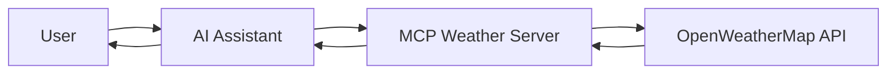

# mcp-weather

A Model Context Protocol (MCP) server that provides weather information for UK
locations using the OpenWeatherMap API.

## What is MCP?

The Model Context Protocol (MCP) is a standard protocol that enables AI
assistants (like Claude) to connect to external tools and data sources. This
server implements MCP to give AI assistants the ability to fetch real-time
weather information.

## What does this server do?

This MCP server provides two weather tools that AI assistants can use:

1. **Weather Forecasts** - Get 5-day weather forecasts for any UK location
2. **Weather Alerts** - Check for active weather warnings and alerts

When integrated with an AI assistant, users can ask natural questions like:

- "What's the weather forecast for London?"
- "Are there any weather alerts in Manchester?"
- "Will it rain in Edinburgh tomorrow?"

The AI assistant will use this MCP server to fetch real-time weather data and
provide accurate, up-to-date responses.

## How it Works



The server:

1. Receives requests from AI assistants via the MCP protocol
2. Translates these into OpenWeatherMap API calls
3. Formats the weather data into human-readable responses
4. Returns the information to the AI assistant

## Available Tools

### `get_forecast`

Retrieves a 5-day weather forecast for a specific location.

**Parameters:**

- `latitude`: Number between -90 and 90
- `longitude`: Number between -180 and 180

**Returns:** Formatted forecast showing:

- Temperature (°C)
- Weather conditions with emoji indicators
- Wind speed (m/s)
- Time periods (3-hour intervals)

**Example Response:**

```text
5-day forecast for London, GB:

🌧️ 2024-01-15 15:00: Light rain, 8°C (feels like 5°C), wind 4.5 m/s
☁️ 2024-01-15 18:00: Cloudy, 7°C (feels like 4°C), wind 3.2 m/s
⛅ 2024-01-15 21:00: Partly cloudy, 6°C (feels like 3°C), wind 2.8 m/s
```

### `get_alerts`

Checks for active weather alerts at a specific location.

**Parameters:**

- `latitude`: Number between -90 and 90
- `longitude`: Number between -180 and 180

**Returns:** Active weather alerts or "No active alerts" message

**Example Response:**

```text
Active alerts for 51.5074, -0.1278:

⚠️ Heavy Rain Warning
Valid: 2024-01-15 12:00 to 2024-01-16 00:00
Heavy rain expected with potential flooding in low-lying areas.
```

## Common UK Coordinates

For testing and reference:

| City       | Latitude | Longitude |
| ---------- | -------- | --------- |
| London     | 51.5074  | -0.1278   |
| Manchester | 53.4808  | -2.2426   |
| Edinburgh  | 55.9533  | -3.1883   |
| Cardiff    | 51.4816  | -3.1791   |
| Belfast    | 54.5973  | -5.9301   |
| Birmingham | 52.4862  | -1.8904   |

## Setup

### Prerequisites

1. **OpenWeatherMap API Key**: Get a free API key from
   [OpenWeatherMap](https://openweathermap.org/api)
2. **Node.js**: Version 18 or higher
3. **npm**: Comes with Node.js

### Installation

```bash
# Clone the repository
git clone https://github.com/denhamparry/mcp-weather.git
cd mcp-weather

# Install dependencies
npm install

# Build the TypeScript code
npm run build

# Set your API key
export OPENWEATHER_API_KEY="your_api_key_here"
```

> **Tip**: Store your API key in a `.envrc` file and use
> [direnv](https://direnv.net/) to load it automatically.

## Usage

This server can run in two modes:

### 1. Standard MCP Mode (for AI Assistants)

This is the primary mode for connecting to AI assistants:

```bash
node build/index.js
```

To integrate with Claude Desktop, add to your configuration:

```json
{
  "mcpServers": {
    "weather": {
      "command": "node",
      "args": ["/path/to/mcp-weather/build/index.js"],
      "env": {
        "OPENWEATHER_API_KEY": "your_api_key_here"
      }
    }
  }
}
```

### 2. HTTP Mode (for Testing)

This mode allows you to test the server with the MCP Inspector:

```bash
# Start the HTTP server
npm run build && node build/http.js

# In another terminal, run the MCP Inspector
npx @modelcontextprotocol/inspector

# Connect to: http://localhost:3000/mcp
```

## Development

### Build and Run with Auto-reload

If you have [Task](https://taskfile.dev/) installed:

```bash
# Run with auto-reload (watches for file changes)
task run-stdio  # For standard MCP mode
task run-http   # For HTTP testing mode
```

### Testing

```bash
# Run all tests
npm test

# Run specific test files
npm test test/weather-utils.test.js  # Unit tests
npm test test/integration.test.js    # Integration tests with real API
```

### Project Structure

```text
mcp-weather/
├── src/
│   ├── index.ts           # Main entry point (stdio transport)
│   ├── http.ts            # HTTP server for testing
│   ├── server-tools.ts    # MCP tool definitions
│   └── weather-utils.ts   # Weather API utilities
├── test/
│   ├── integration.test.js
│   └── weather-utils.test.js
├── Docker/                # Docker configurations
├── kubernetes/            # Kubernetes manifests
└── examples/              # Integration examples
```

## Docker Deployment

Build and run with Docker:

```bash
# Build images
docker build -f Docker/Dockerfile.stdio -t mcp-weather:stdio .
docker build -f Docker/Dockerfile.http -t mcp-weather:http .

# Run containers
docker run -it --rm -e OPENWEATHER_API_KEY="your_key" mcp-weather:stdio
docker run -p 3000:3000 --rm -e OPENWEATHER_API_KEY="your_key" mcp-weather:http
```

## Kubernetes Deployment

Deploy to a Kubernetes cluster:

```bash
# Using Task (recommended)
OPENWEATHER_API_KEY="your_key" task kubernetes-apply
task kubernetes-port-forward

# Or using kubectl directly
kubectl create secret generic openweather-api-key \
  --from-literal=OPENWEATHER_API_KEY="your_key"
kubectl apply -f kubernetes/
kubectl port-forward svc/mcp-weather 3000:3000
```

## Troubleshooting

### Common Issues

1. **"Failed to retrieve forecast data"**

   - Check your API key is valid
   - Ensure you've set the `OPENWEATHER_API_KEY` environment variable
   - Verify your internet connection

2. **Connection refused when testing**

   - Make sure the server is running
   - Check you're using the correct port (3000 for HTTP mode)
   - Ensure no other service is using port 3000

3. **No weather alerts showing**
   - Weather alerts are location and time-specific
   - Many UK locations may not have active alerts
   - Try different coordinates or check during severe weather

### Debug Mode

Enable debug logging:

```bash
DEBUG=* node build/index.js
```

## Contributing

Contributions are welcome! Please feel free to submit a Pull Request.

## License

ISC License - see the [LICENSE](LICENSE) file for details.

## Acknowledgments

- Weather data provided by [OpenWeatherMap](https://openweathermap.org/)
- Built with the
  [Model Context Protocol SDK](https://github.com/modelcontextprotocol/sdk)
